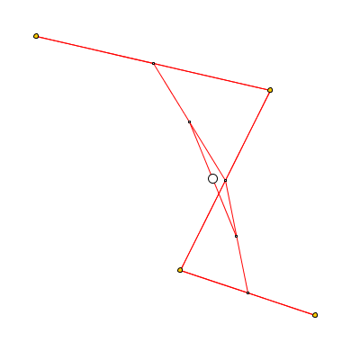

# Creative coding projects
A collection of some of my personal projects done in processing.
## A brief overview:

Bezier Curve using de Casteljau's algorithm       | Marching Squares | Grass field (work in progress)
:-------------------------:|:-------------------------:|:-------------------------:
 |  | 

tubular-1             | growing-circles-1 | feathers-1
:-------------------------:|:-------------------------:|:-------------------------:
 |  | 

van-goghify                | spinning-square-1 | modular-grid (interactive)
:-------------------------:|:-------------------------:|:-------------------------:
 |  | 

hairy-brush (interactive)                | jellyfish | physics-water-surface (interactive)
:-------------------------:|:-------------------------:|:-------------------------:
 |  | 

<!-- for my own reference:
ffmpeg -r 60 -i frame_%03d.png -c:v libx264 -c:a aac -ar 44100 -pix_fmt yuv420p output.mp4

ffmpeg -f image2 -i frame_%3d.png -vf "setpts=0.5*PTS" out.gif

Alternatively (this might make color correct better):

ffmpeg -i frame_%03d.png -vf palettegen palette.png

then

ffmpeg -i frame_%03d.png -i palette.png -lavfi paletteuse video.gif

-->