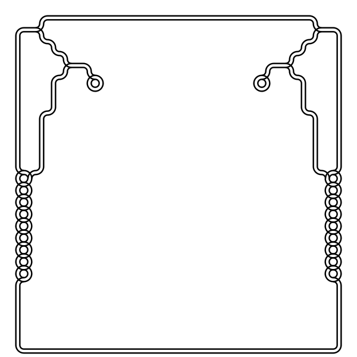

# modular-grid
A grid that renders svg tiles based on its neighbors. Drag the mouse to draw some tiles and see how the rendered tiles change!
My implementation of [Generative Design](http://www.generative-gestaltung.de/2/) P.2.3.6 with some tweaks of my own. Tiles made by [Mats N. Olsen](https://www.instagram.com/claystation2/).

## Settings
I have provided a few settings. The size of the window is determined `tileSize`, `xNumTiles` and `yNumTiles`. The setting names are not case sensitive but needs to be delimited by `=`. This is the default configuration:
```
tileSize=20
xNumTiles=10
yNumTiles=10
templateName=spaceInvader.png
```
### **Some notes:**
* `tileSize`, `xNumTiles` and `yNumTiles` are integers. Trying to put float values might cause the software to crash.
* If a template of the name given by `templateName` exists in the data folder, `xNumTiles` and `yNumTiles` will be set by the width and height of the picture.
* If you want to make your own tiles, simply replace the SVG files in data. It is important that the tiles 
## Controls
| Key | Description |
--- | --- |
**p** | Change from pixel view to module view
**s** | When in pixel view: Save the pixel map as a .png (in root, named `pixelMap.png`). When in module view: save the picture as a .svg (given by `frame-####.svg`)
**c** | clear canvas
**r** | reflect the currently drawn tiles (only draws new tiles, does not erase any)
**m** | start mirroring drawing
**l** | load template image,

